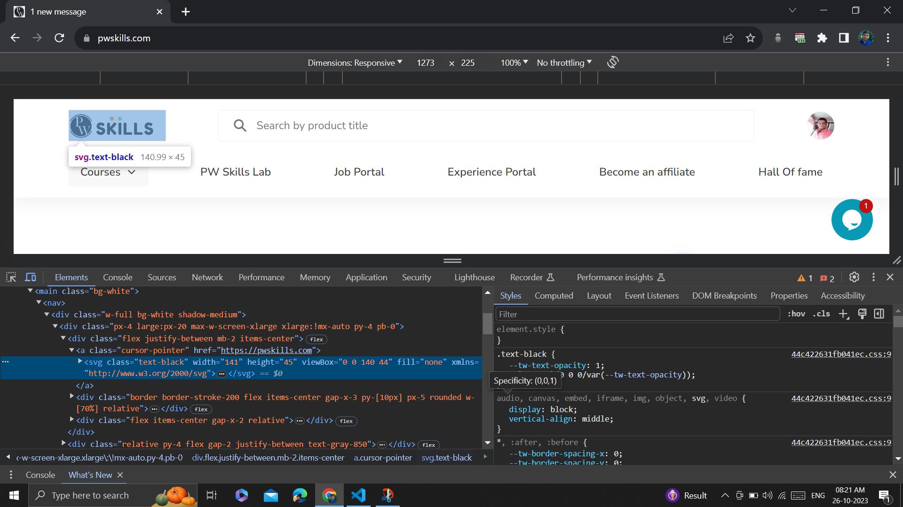
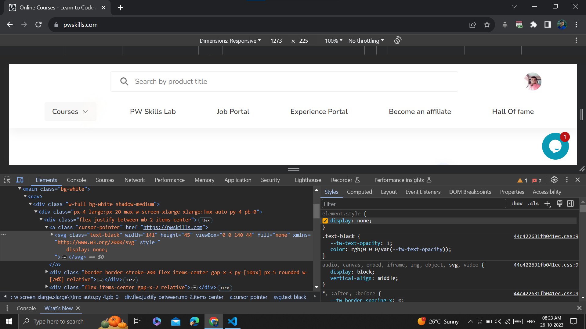
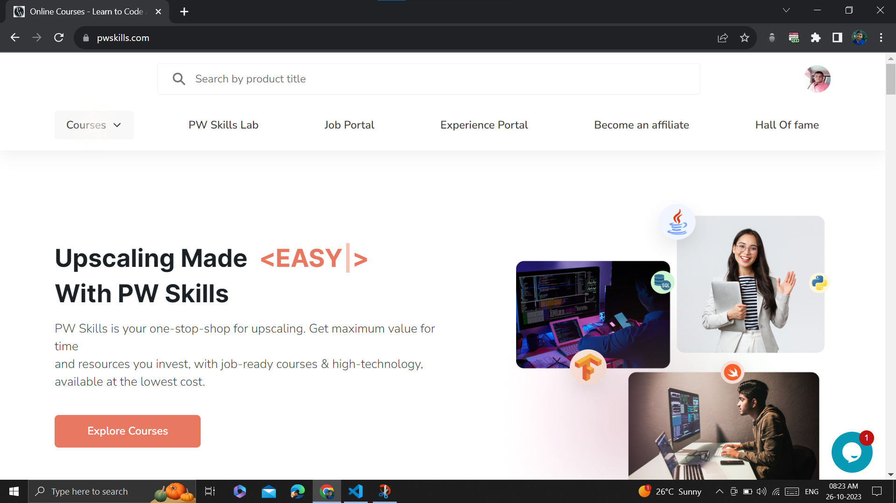

<h2>Step 1</h2>

Visited <a href="https://pwskills.com/" target="_blank">PW Skill's</a> website.
 

<h2>Step 2</h2>

Opened developer tools and selected the website logo.

<h2>Step 3</h2>

Gave display:none value to the logo element.

<h2>Step 4</h2>

Website logo is now hidden.

