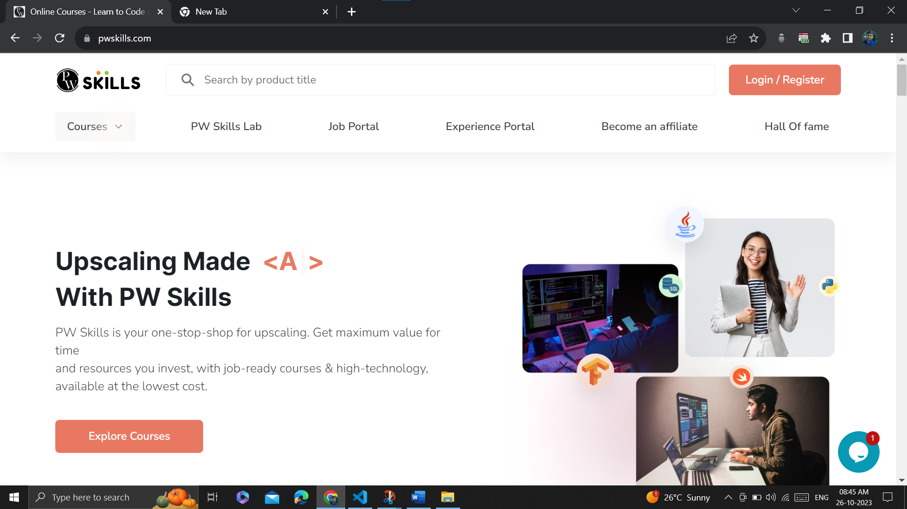
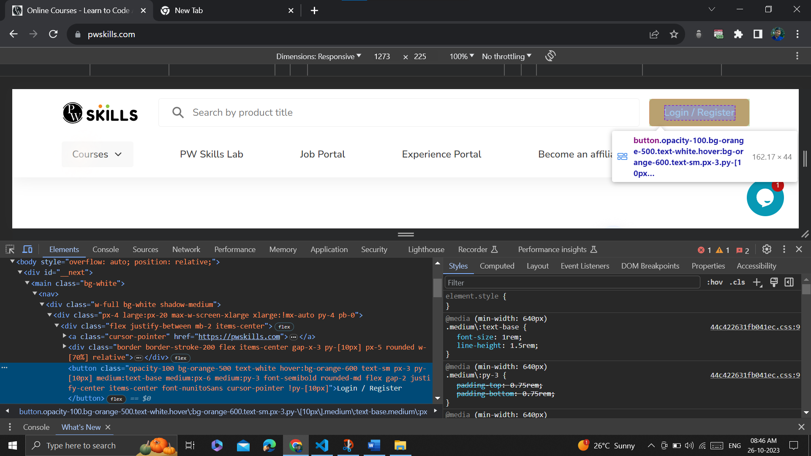
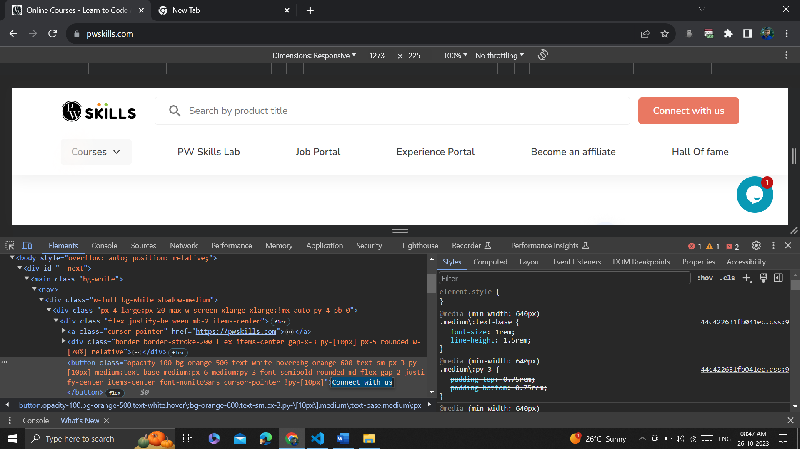

<h2>Step 1</h2>

Visited <a href="https://pwskills.com/" target="_blank">PW Skill's</a> website.
 

<h2>Step 2</h2>

Opened developer tools and selected nav Login/Register button.

<h2>Step 3</h2>

Changed the button content from "Login/Register" to "Connect with us".

<h2>Button</h2>

Nav button content is now "Connect with us"

